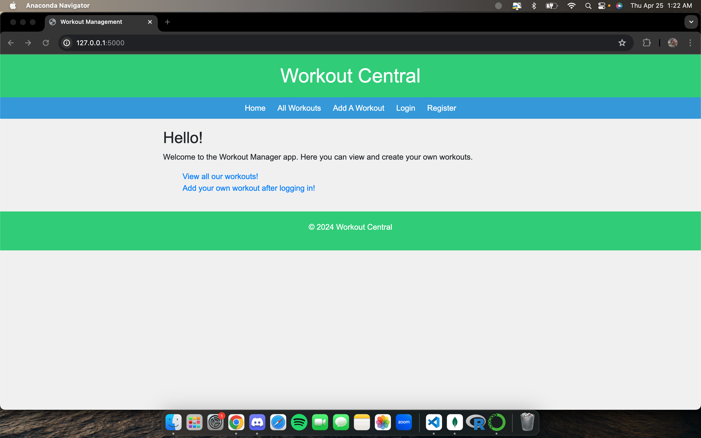
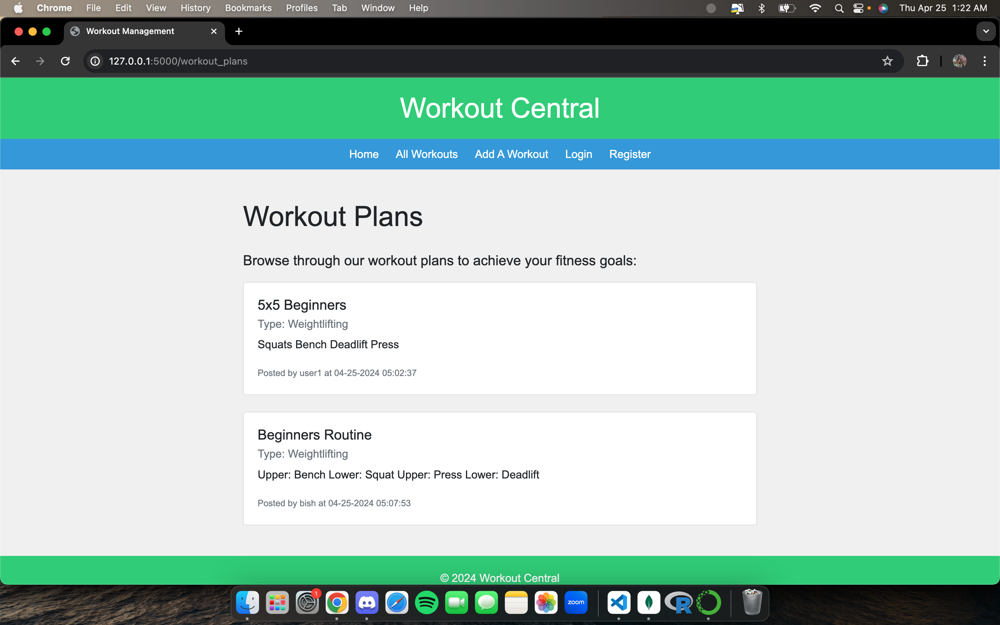
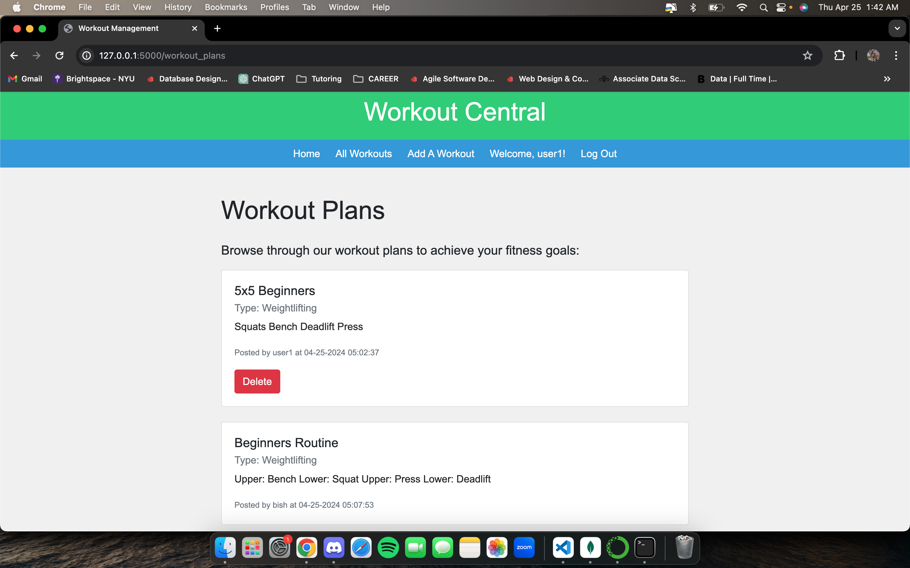
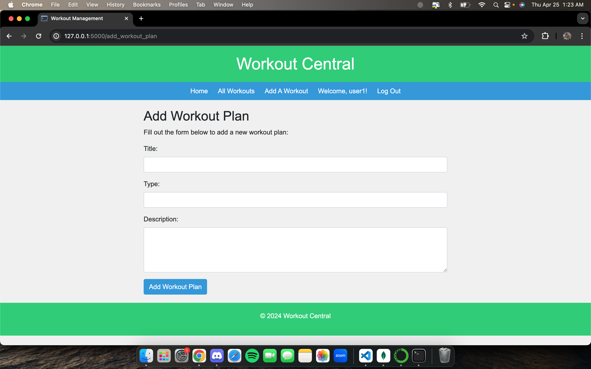

# Flask-Mongo Web App: Workout Central
##### Anas Moazzam

My web app is called Workout Central. This app allows users to come to a place to access workouts or share their own to the fitness community. We first land in the home page. Here, there are two links to our main service: viewing workouts and sharing workouts. Any user, registered or not, is able to view workouts through the All Workouts page. This page shows the title of the workout, what type of workout (weightlifting, sport specific, etc.) and the workout routine itself. Only the user who created the post will see a delete button and be able to delete the workout from the page. However, only logged in registered users can add workout plans through the Add A Workout page. If a non logged in user clicks this page, they are redirected to the Log-In page. On the Add A Workout page, users enter the title, workout type, and the workout routine. Users can either Login or Register. Both pages allow users to travel to each page so users can do what is necessary for them. Finally, the LogOff button appears only if someone is logged in, which takes away the LogIn and Register buttons as well.

### Here are some screenshots of the Web App running locally:

#### Disclaimer
I was not able to connect to I6. I understand that this was a key component of the assignment, but I just could not complete this. To make up for this a little bit, I tried my best to include more functionality within the web app such as advanced user handling, better UI, and more intensive functionality to reflect practical functionality (such delete only being available to users who created the app). I know this will not cover for the I6 factor, but I hope the other features help my grade as well. I am also using BOTH my extensions on this assignment. Thank you for the consideration.

​
